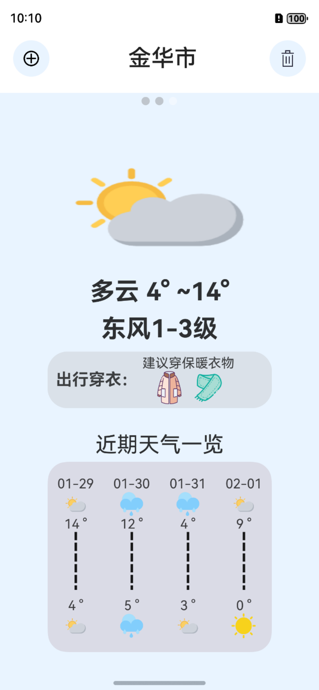

# WeatherForecast (天气预报)

这是一个基于 OpenHarmony 的轻量级天气预报应用程序。它结合了本地 SQLite 数据库存储和高德天气 API，为用户提供查看城市天气预报的功能。

## 主要功能

*   **实时天气查询**
    *   对接高德地图 Web 服务 API，获取精准的实时天气及多日预报
    *   支持气温、天气现象、风向风力等详细信息展示

*   **城市管理**
    *   **添加城市**：支持按城市名称搜索并快速添加关注城市
    *   **删除城市**：首页支持一键删除不再关注的城市，并同步清理本地数据

*   **持久化存储**
    *   基于 RelationalStore (RDB) 的本地数据库存储
    *   应用启动自动加载已保存的城市列表，确保数据不丢失
    *   城市增删操作实时同步至本地数据库

##  应用截图

<div align="center">
  
    
  
</div>

##  技术栈

*   **开发语言**: ArkTS (TypeScript)
*   **UI 框架**: ArkUI (声明式组件)
*   **构建工具**: Hvigor
*   **数据库**: RelationalStore (SQLite)
*   **网络通信**: @kit.NetworkKit (HTTP)
*   **地图服务**: AMap (高德地图) 天气 API

##  项目结构

```
d:\WeatherForecast
├── entry/
│   └── src/main/ets/
│       ├── data/           # 数据存储 (WeatherStore.ets)
│       ├── pages/          # 页面 (Index, AddCityWeatherPage)
│       ├── view/           # 自定义组件 (cityview.ets)
│       ├── viewmodel/      # 模型与工具 (WeatherModel, getWeatherUtil)
│       └── entryability/   # 应用入口 Ability
├── AppScope/               # 全局资源配置
└── oh_modules/             # 第三方依赖
```

##  快速开始

### 环境要求

*   DevEco Studio
*   HarmonyOS SDK (API 10+)

### 安装步骤

1.  克隆或下载本项目代码。
2.  使用 DevEco Studio 打开项目目录 `d:\WeatherForecast`。
3.  等待 Sync 完成，下载必要的依赖。
4.  配置签名（如需真机调试）。
5.  点击运行 (Run) 按钮启动应用。

### 注意事项

*   **API Key**: 项目在 [getWeatherUtil.ets](file:///d:/WeatherForecast/entry/src/main/ets/viewmodel/getWeatherUtil.ets) 中使用了高德 Web 服务 Key。在实际部署前，请替换为您申请的 Key。
*   **网络权限**: 应用已在 `module.json5` 中申请 `ohos.permission.INTERNET` 权限。
*   **数据库**: 本项目使用本地数据库 `weather.db` 存储城市 adcode，表名为 `weatherlist`。

##  待办事项

*   1.增加自动定位并展示当前城市天气功能
*   2.优化多城市并发请求的加载动画
*   3.增加极端天气预警推送功能

## 

本项目仅供学习和演示使用。
